# Auto-WCEBleedGen Challenge-2023 for Automatically Detecting and Classifying Bleeding/Non-bleeding Frames

We showcase our solution and subsequent progress for the [Auto-WCEBleedGen Challenge](https://misahub.in/CVIP/challenge.html) to create, test, and evaluate cutting-edge Artificial Intelligence (AI) models for automatically detecting and classifying bleeding/non-bleeding frames extracted from Wireless Capsule Endoscopy (WCE) videos. Our project uses the dataset created by the Auto-WCEBleedGen Challenge organizers. The training dataset encompasses various gastrointestinal bleeding scenarios, accompanied by medically validated binary masks and bounding boxes. Our objective is to facilitate comparisons with existing methods and enhance the interpretability and reproducibility of automated systems for bleeding detection using WCE data. 

### Contents
* [Team members](https://github.com/NPCalicut/Blood/blob/Raghul_branch_1/README.md#team-members)
* [Overview](https://github.com/NPCalicut/Blood/blob/Raghul_branch_1/README.md#overview)
* [Data](https://github.com/NPCalicut/Blood/blob/Raghul_branch_1/README.md#data)
* [Method](https://github.com/NPCalicut/Blood/blob/Raghul_branch_1/README.md#models)
* [Results](https://github.com/NPCalicut/Blood/blob/Raghul_branch_1/README.md#results)
* [How to run](https://github.com/NPCalicut/Blood/blob/priya_branch_1/README.md#how-to-run)

## Team members
- Dr. Kalpana George 
- Abhiram A P
- Alice Divya Nelson
- Harishma N

## Overview  

Gastrointestinal (GI) bleeding is a medical condition characterized by bleeding in the digestive tract, which circumscribes the esophagus, stomach, small intestine, large intestine (colon), rectum, and anus. Wireless capsule endoscopy (WCE) is an efficient tool for investigating GI tract disorders and performing painless intestine imaging (Figure-1). For an experienced gastroenterologist, it is estimated to take at least 2 to 3 hours to inspect the WCE captured video of a patient. This tedious process of frame-by-frame analysis can result in human errors. In a developing country like India, there is an increasing demand for the research and development of robust, interpretable, and generalized AI models to assist doctors in addressing the challenges faced in concluding the WCE reports of increasing patients. Through the help of computer-aided classification and detection of bleeding and non-bleeding frames, gastroenterologists can reduce their workload and save valuable time. Our project focuses on a deep neural network approach, and through the evaluation results obtained, the model ResNet-50 and ResUnet is finalized as the best models for classification and segmentation, respectively. The above conclusion of the models was specifically based on the model's accuracy metrics for classification and IoU (Intersection Over Union) metrics for segmentation, along with its prediction images. The achieved accuracy of the classification best model is 0.983, and the IoU value for the segmentation best model is 0.938.   

 
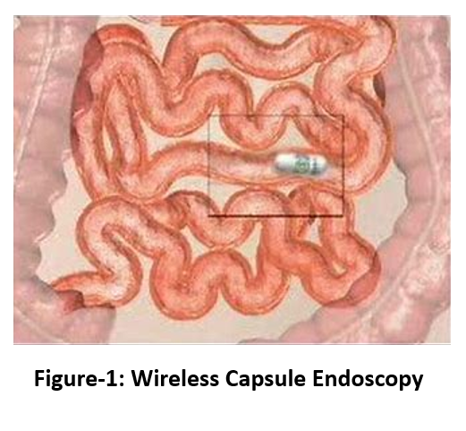

## Dataset
The given training dataset consists of 2618 color images obtained from WCE. The images are in 24-bit PNG format with 224 × 224 pixel resolution. The dataset comprises two equal subsets: 1309 images as bleeding images and 1309 as non-bleeding images. Also, it has corresponding binary mask images for both subsets (Figure 2). Each subset is split into two parts: 1049 (80%) images for training and 260 (20%) images for validation. The bleeding subset annotated by human experts contains 1309 binary masks in PNG format with  224 x 224 pixel resolution. White pixels in the masks correspond to bleeding localization.  

 
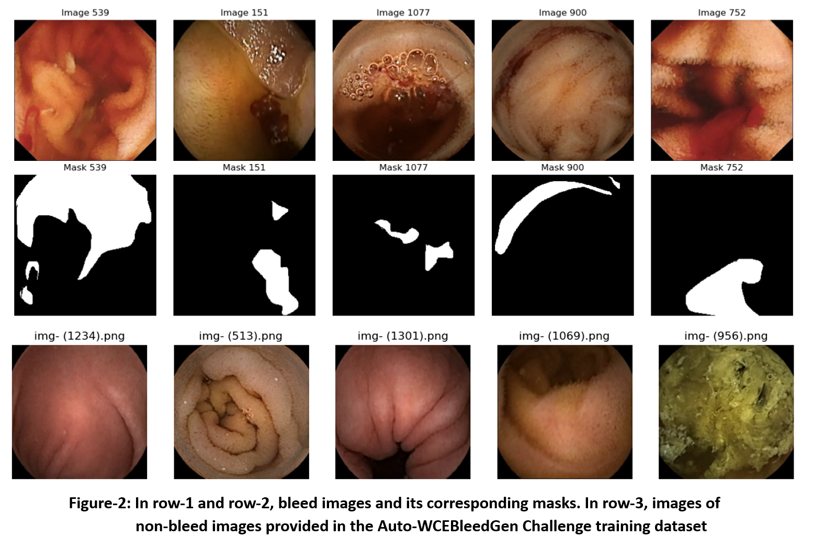

## Method
### 1. Analysing pixel intensity of bleeding and non-bleeding .images 

In an RGB image, the R channel is essential in distinguishing between bleeding and non-bleeding frames because bleeding usually appears red. The R, G, and B intensity histograms are plotted using training images with bleed and non-bleed regions (Figure-3). We observed that the intensity distribution of red pixels is almost similar for both bleed and non-bleed, which makes it difficult to distinguish between bleeding and non-bleeding pixels. The intensity of overlaps between green and blue channels is also high, making distinguishing between bleeding and non-bleeding pixels in frames difficult. Therefore, employing conventional machine learning techniques to distinguish between bleeding and non-bleeding images would be challenging. We, therefore, decided to go with deep learning models for the classification and detection of bleeding images.

 
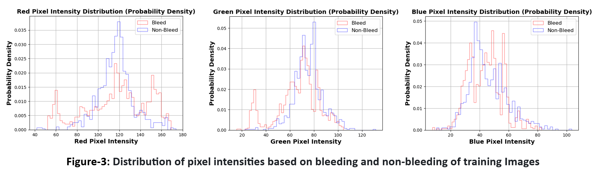

From the deep Learning models, we first tried a simple 5-layer Convolutional Nueral Network(CNN) model from scratch. Due to the unsatisfactory outcomes of this model, we switched to more efficient pretrained models. The different deep-learning architectures that we evaluated for classification are **VGG-16, ResNet-50, and ResNet-101**.   

 

We tried the different models for segmentation: **YOLOv8, ResUnet, and Attention U-Net**. YOLOv8 is a powerful and versatile object detection algorithm that can be used in various real-world scenarios to detect and classify objects with high accuracy and speed. On the other hand, the ResUnet is built from scratch, which enables it to learn the critical features from the given dataset more precisely. The third model, Attention U-Net, uses a ResNet-101 pre-trained on ImageNet dataset as its backbone.  

### 2. Training
**Classification:**

The training dataset comprises 2618 color images and it is split in an 80:20 ratio for training and validation, respectively. For classification, we had done 5-fold cross validation. In **5-fold cross-validation**, the data is divided into five equal-sized subsets or folds. 

The training process starts by training the model on four folds or subsets of the data, while the remaining fold acts as the validation set. The process described in Figure 4(a) involves repeating the procedure five times, where each fold is used as the validation set once. 

  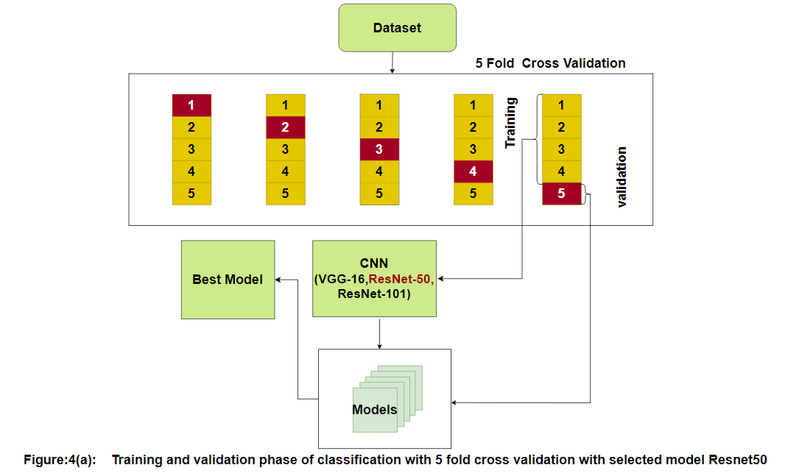

In summary, the training phase involves feeding the data into the CNN architecture by adjusting the model’s parameters (weights and biases) based on the input data and optimizing the model’s performance. The validation phase involves assessing the performance of the trained model on a separate dataset that was not used during training, indicating the model’s generalization ability. 

  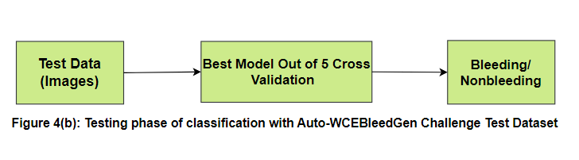

According to Figure 4(b), the best model out of the 5-fold cross-validation is employed to classify test images as either bleeding or non-bleeding by using the Auto-WCEBleedGen Challenge Test Dataset.  

It has been concluded that ResNet-50 demonstrates the best performance based on the metrics(Accuracy, F1 score, Recall) derived from the best model predictions out of the 5-fold cross-validation. Therefore, it is considered the optimum classification model as indicated in red in Figure 4(a). 

 **Segmentation:**

 For segmentation, the training dataset contains bleeding images and their corresponding ground truth images. Here, we are using an 80:20 split for training and validation data. During the training phase of the segmentation process, we experimented with different segmentation models, including ResUNet, YOLOV8, and Attention U-Net. These models were trained using annotated images and their corresponding ground truth data at the pixel level. 
 

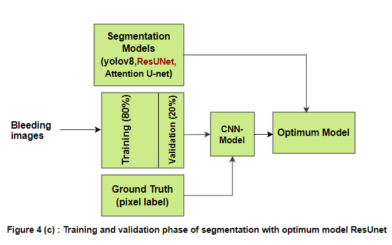

After a thorough analysis of the performance of YOLOv8, Attention U-Net, and ResUNet in identifying bleeding zones, it has been determined that the ResUNet model consistently achieves the most favorable results. As a result, it is considered the optimum model for this segmentation task, as indicated in red in Figure 4(c). 

  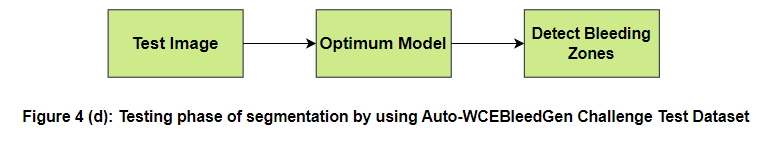

Figure 4(d) illustrates the testing phase, where the chosen ResUNet (optimum model) is employed to process the testing image, effectively identifying and detecting the presence of bleeding zones. 

## Results

### 1. Classification

#### 5-Fold cross validation results for classification: 

**Note**: Here we put best model accuracy of 5-fold cross-validation results  

**Table 1.1 :** Validation results of different classification models: 

| Model | Accuracy | Recall | F1-Score |
| --- | --- | --- | --- |
| VGG-16 | 0.9943 | 0.9923 | 0.9942 |
| ResNet-50 |0.9828  |0.9885 |0.9829 |
| ResNet-101 | 0.962 |0.966 | 0.952|

As shown in Table 1.1, VGG-16 achieved good accuracy, recall, and F1-scores. However, ResNet-50 outperformed both VGG-16 and ResNet-101 in terms of prediction, with an accuracy of 0.9828, recall of 0.9885, and F1-score of 0.9829. Although ResNet-101 attained flawless evaluation scores, ResNet-50 is considered the best model out of five cross validations in terms of accuracy, recall and f1 score for classification tasks due to its superior performance compared to VGG16 and ResNet-101. 

  
**Screenshot of results:**

 
**a)- Predicted Bleed class images from validation dataset**

 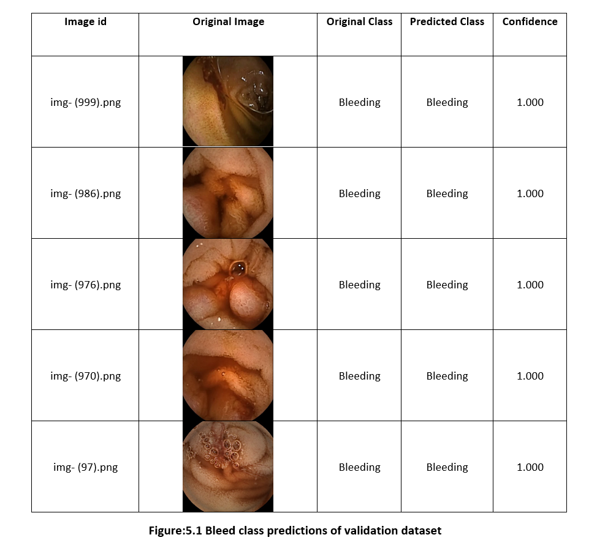

**b)- Predicted Non-bleed class images from validation dataset**

 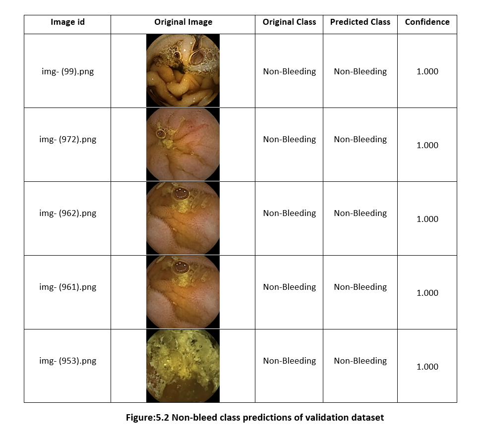

**c)- Predictions of test dataset-1** 

 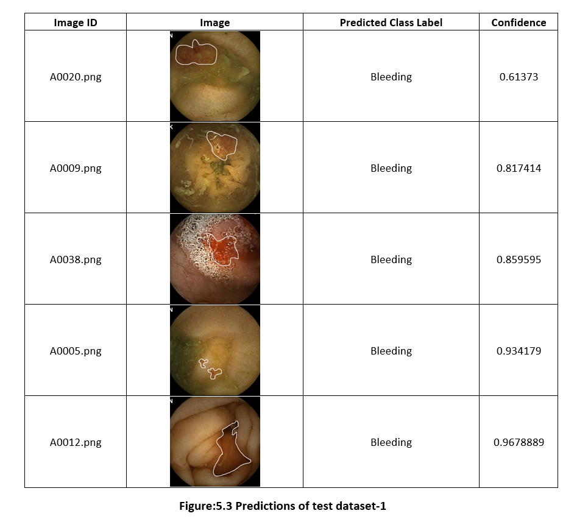

**d- Predictions of test dataset-2**

 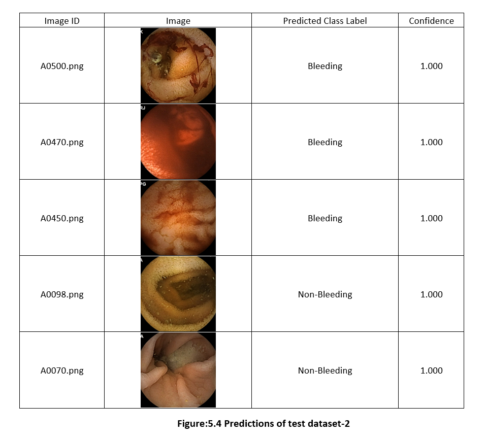

### 2. Segmentation

#### Validation results for segmentation:   

**Table 2.1 :** Validation results of different segmentation models: 

| Model | Average precision | Mean Average Precision | IOU |
| --- | --- | --- | --- |
| ResUNet | 0.9791 | 0.9791 | 0.938 |
| YOLOv8 |0.88  |0.88 |0.63 |
| Attention U-Net | 0.272 |0.272 | 0.378|

 **Table 2.1** Indicates that ResUNet outperforms the other two models regarding average precision (AP) and mean average precision (MAP). The intersection over union (IOU) score for ResUNet is comparatively high. ResUNet is, therefore, the most effective model out of the three for the segmentation task. Here we want to mention that, AP and MAP is same due to the number of class that we used for evaluation is one.

**Screenshot of results:**
 
**a)  Predictions of segmentation in validation dataset**

 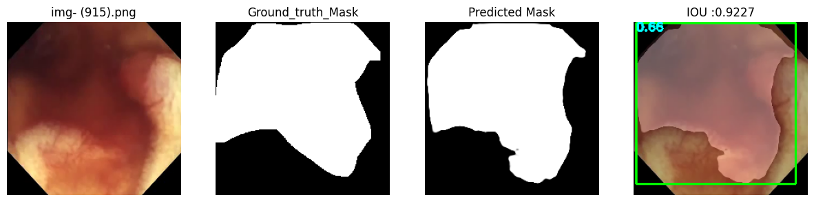
 

 
 

 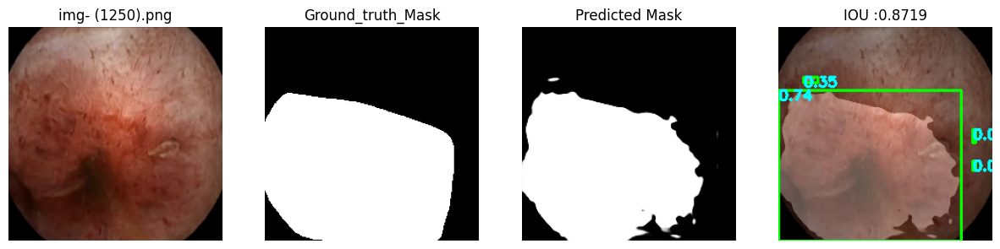
 

 

 
 

 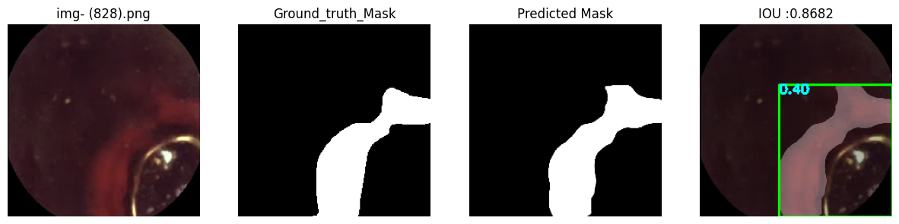
 

 

 
 

 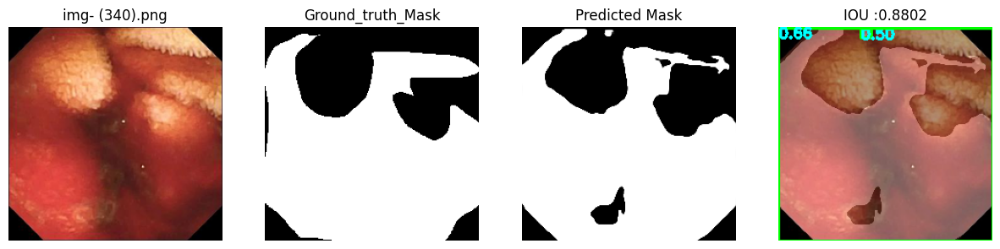
 

 
 
 

 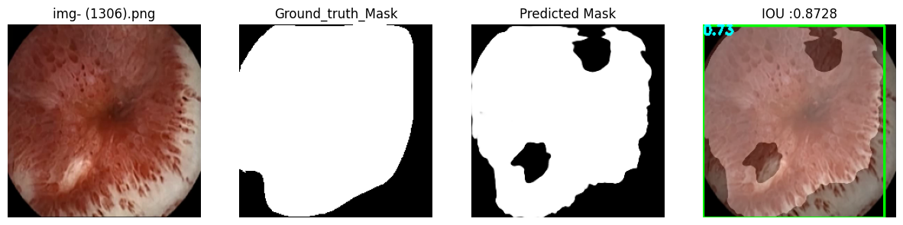
 

 

 
 

 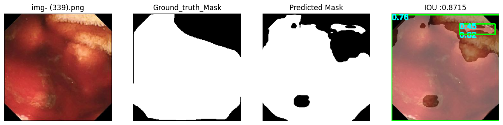
 

 

 

 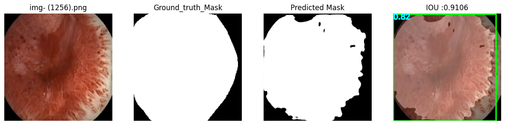
 

 

 

 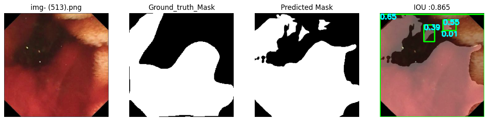
 

 

 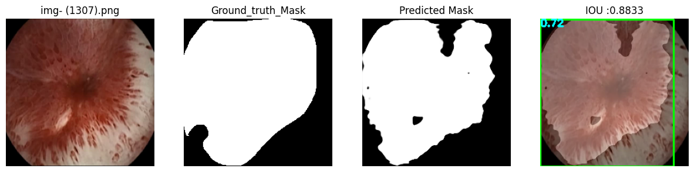
 

 

 

 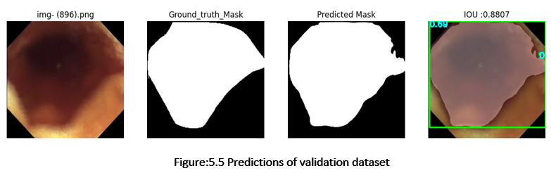
 

 

**b) Predictions of segmentation in test dataset-1**

 

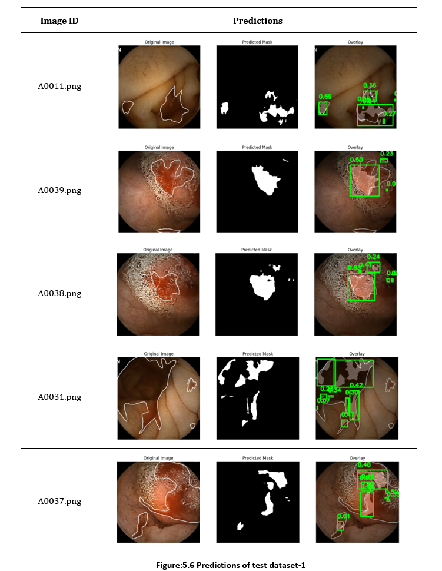

**c) Predictions of segmentation in test dataset-2**

 

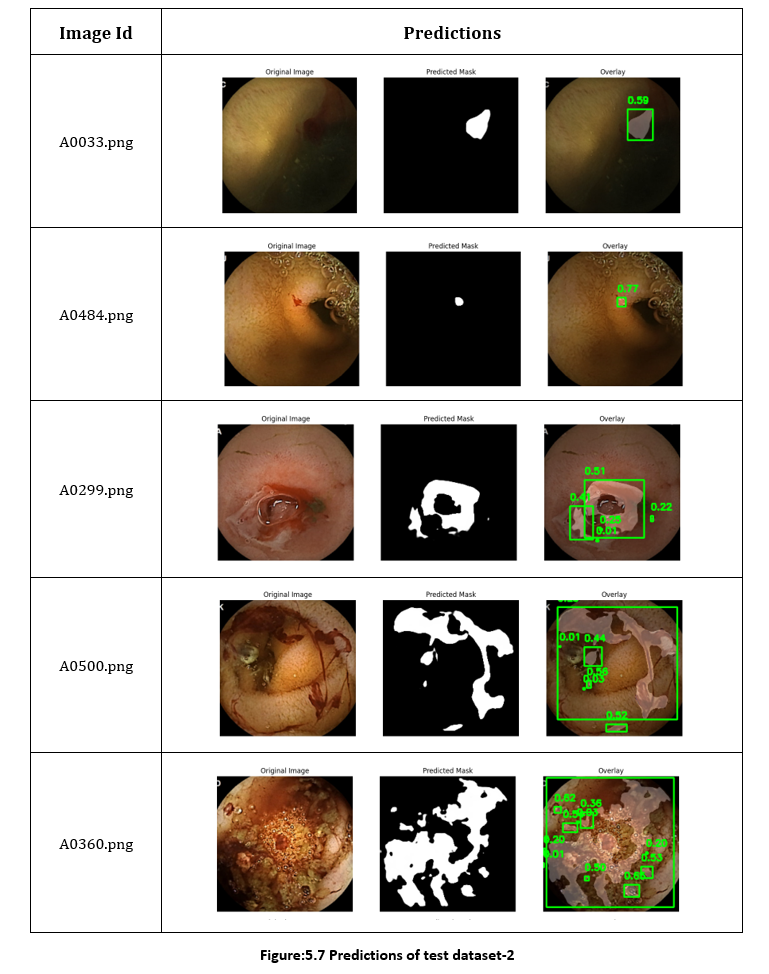

## 3. Comparison of the model complexities  

**Table 3.1: Classification** 

| Model      | Size       | Total Parameters | Trainable Parameters | No of Layers | Time (ms) Inference Step (GPU) |
| :--------- | :--------: | :---------------: | :-------------------: | :-----------: | :----------------------------: |
| VGG-16      | 174.4 MB   |     15.2 million |         15.2 million |           16 |                       184 ms |
| ResNet-50   | 294.6 MB   |     25.6 million |         25.6 million |           50 |                       142 ms |
| ResNet-101  | 513.3 MB   |     44.7 million |         44.6 million |          101 |                       223 ms |

The complexity of a deep learning model increases along with the number of parameters and layers in the model architecture. This increased complexity can lead to longer training times and higher computational requirements. The complexity of the model alone does not determine performance or accuracy, and it is also correlated with the image feature complexity. The inference time is calculated in GPU and updated in the Table 3.1 and Table 3.2 .Looking at the table provided, it is clear that the VGG-16 model has lower complexity than the rest of the models used in the study and exhibits the lowest accuracy, as shown in Table 1.1. In the WCE dataset, ResNet-50 performs better than the complex model ResNet-101 in terms of performance. Additionally, ResNet-101 has a longer inference time, indicating that it is computationally more complex than the other models. Hence, ResNet-50 is considered the optimum model for classification.

**Table 3.2 :  segmentation** 

| Model      | Size       | Total Parameters | Trainable Parameters | No of Layers | Time (ms) Inference Step (GPU) |
| :--------- | :--------: | :---------------: | :-------------------: | :-----------: | :----------------------------: |
| ResUNet | 39.3 MB   |     3.42 million  |         3.42 million  |           5 |                       100 ms |
| YOLOv8  | 6 MB   |     3.2 million  | 3.2 million  |           261 |                       200 ms |
| Attention U-Net   | 288.85MB    |     43.6 million  |    15.94 million  |          202 |                       333 ms | 

When comparing the models mentioned in Table 3.2 above, ResUNet stands out with lower complexity in size, number of parameters, and inference time compared to the other models. On the other hand, Attention U-Net is more computationally complex, as indicated by its longer inference time. Considering the performance evaluation metrics and complexity analysis, ResUNet is the optimal model choice.  

### 4. Interpretability plot:

**CAMs**: *Class Activation Maps*, or *CAMs*, offer a means to see which pixels in an image most strongly influence how the model classifies it. In other words, a CAM shows how "important" each pixel in an input image is for a certain classification.

**Note:** Here, we used the Resnet50 model, which is our best model, to produce the CAMs plot.

**3.1.1 CAMs plot for validation dataset**

The following images are the best 10 images that we predicted as bleed using validation dataset. 

 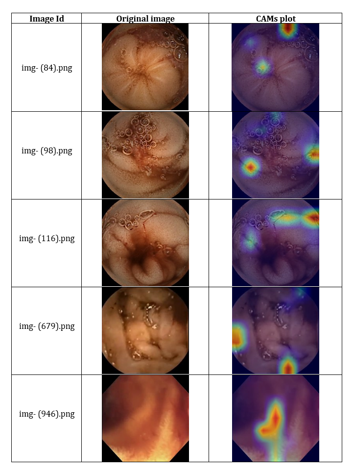

 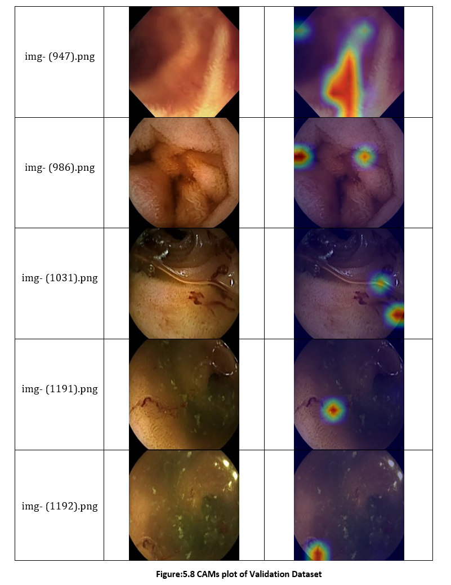

**3.1.2 CAMs plot of predictions using test dataset-1**

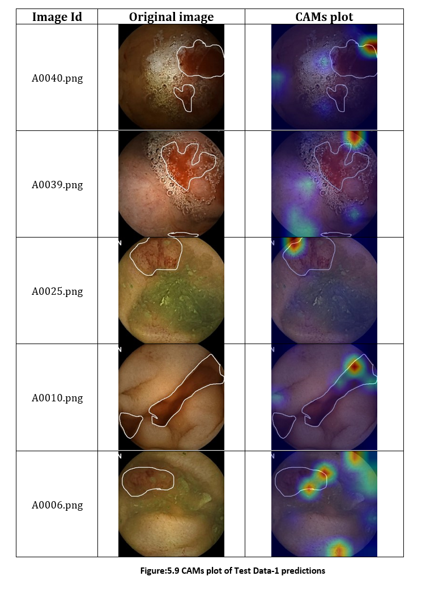

**3.1.3 CAMs plot of predictions using test dataset-2**

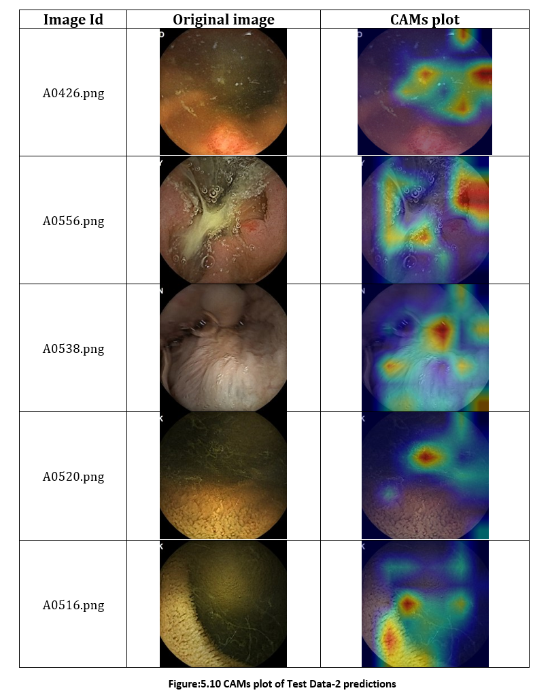

## How to run

 
The dataset is organized in the folloing way:
####
**classification** 
&nbsp;&nbsp;&nbsp;&nbsp;&nbsp;&nbsp;&nbsp;&nbsp;&nbsp;&nbsp;&nbsp;&nbsp;&nbsp;&nbsp;&nbsp;&nbsp;&nbsp;&nbsp;&nbsp;&nbsp;&nbsp;&nbsp;&nbsp;&nbsp;&nbsp;&nbsp;&nbsp;&nbsp;&nbsp;&nbsp;&nbsp;&nbsp;&nbsp;&nbsp;&nbsp;&nbsp;&nbsp;&nbsp;&nbsp;&nbsp;&nbsp;&nbsp;&nbsp;&nbsp;&nbsp;&nbsp;&nbsp;&nbsp;&nbsp;&nbsp;&nbsp;&nbsp;&nbsp;&nbsp;&nbsp;&nbsp;&nbsp;&nbsp;&nbsp;&nbsp;&nbsp;&nbsp;&nbsp;&nbsp;&nbsp;&nbsp;&nbsp;&nbsp;&nbsp;&nbsp;&nbsp;&nbsp;&nbsp;&nbsp;&nbsp;&nbsp;&nbsp;&nbsp;
**segmentation**

 

    ├── data                                                  ├── data
    │   ├── train                                             │   ├── train
    │   │     ├── Bleed                                       │   │     ├── Bleed 
    │   │     └── Nonbleed                                    │   │     │      ├── Images
    │   └── validation                                        │   │     │      └── Masks
    │           ├── Bleed                                     │   │     └── Nonbleed
    │           └── Nonbleed                                  │   │            ├── Images
    ├── test                                                  │   │            └── Masks
    │    ├── Testdata1                                        │   └── validation
    │    └── Testdata2                                        │         ├── Bleed
                                                              │         │     ├── Images
                                                              │         │     └── Masks
                                                              │         └── Nonbleed
                                                              │               ├── Images
                                                              │               └── Masks
                                                              └── test
                                                                    ├── Testdata1
                                                                    └── Testdata2

 

The training dataset contains two sets of images: one set with bleeding and the other set without bleeding. The entire training data is split with 80% allocated for training and 20% for validation. For training the dataset, we split it into five folds for five-fold cross-validation to perform classification.                                                                    
In order to perform segmentation, we utilized the WCEBleedGen dataset, which was also split in an 80:20 ratio for training and validation. The training dataset consists of two separate sets: one set containing bleeding images and their corresponding masks, and another set containing non-bleeding images and their corresponding masks. Similarly, the validation set follows the same format, with separate sets for bleeding and non-bleeding images along with their corresponding masks.

 

We used the Auto-WCEBleedGen Challenge Test Dataset for testing, which includes  tasetdata1 and testdata2 and only contain images. Thise dataset were used to assess model predictions.

 

Before running the code, we need to organize the classification dataset in the above format.  
### How to run classification model 
**1. Training**

**Installing dependencies**

The first step for training the model is to installing the necessary dependencies. It can be achieved by `` pip install -r requirements.txt`` .The main file that is used to train our best model (ResNet-50) is  ``train.py``. To train this model we used the following bash script (batch size should be adjusted depending on how many samples to be fit into the GPU RAM, and corresponding paths for training data should be changed before running the bash command)

 

``python3 train.py``

 

**2.Validation**

 

For validating the model, we have uploaded a ``validation.py`` file. To validate this model, we need to give the correct path of the model saved after training and the path of the validation dataset also should be updated. After that use the bash command:

 

``python3 validation.py                                                                  ``

 

**3.Prediction**

 

Testing of the model is done using ``prediction.py``. To test the model, we need to load the saved model and edit the test image path which contains images to be tested. Then use the bash command:

 

``python3 prediction.py                                                                  ``

 

### How to run Segmentation model

 

Before running the code, we need to organize the segmentation dataset in the above format.

 

**1.Training**

 
The first step for training the model is to installing the necessary dependencies. It can be achieved by `` pip install -r requirements.txt``.The file that is used for training the Residual U-net (optimum model) is -``segtrain.py``. Before using the bash command change the path of the ground truth mask and original images in ``train.py`` and batch size should be adjusted depending on how many samples to be fit into the **GPU RAM**. Then use the bash command  

 

``python3 segtrain.py                                                                    ``

 

**2.Validation**  

 

For validating the model, we used ``segvalid.py``. Here also the original image as well as path to the mask should be updated correctly in ``segvalid.py``. Provide the correct path of the model which is being saved after training and also provide the path for saving the output mask. Then the bash command provided below can be used for validation.  

 

``python3 segvalid.py                                                                    ``

 

**3.Evalution**

 

For evaluating the Residual U-net model use ``segeval.py``. For running ``segeval.py`` we need to change the path of the ground truth mask and also change the path of the predicted mask folder in ``segeval.py``. Then run the bash command:

 

``python3 segeval.py                                                                     ``

 

**4. Prediction**

 

For testing the model, we can use ``segpredict.py``. Before running this, we need to make necessary changes in ``segpredict.py`` like giving the correct path of the model and also the paths of the test folder ``segpredict.py``. Bash command for prediction:

 

``python3 segpredict.py                                                              ``     

Note:The entire code is run on the GPU 
``NVIDIA-SMI 520.61.05,Driver version 520.61.05, CUDA version 11.8``

Demo Example
------------

A demonstration example for classification and segmentation can be found in `classification_demo.ipynb` and `segmentation_demo.ipynb`.

